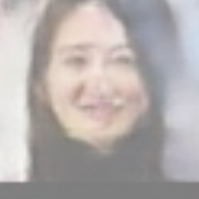
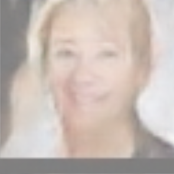
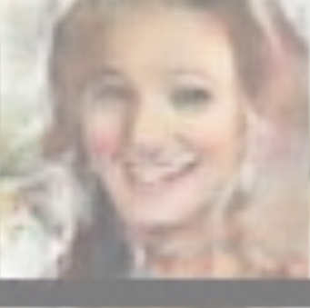
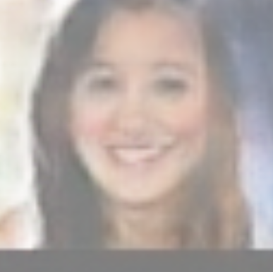
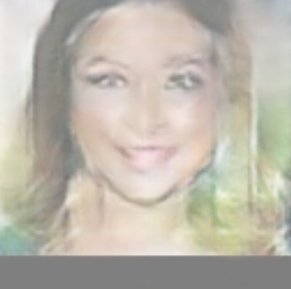
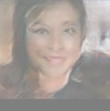
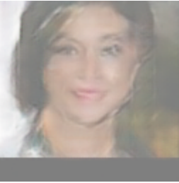
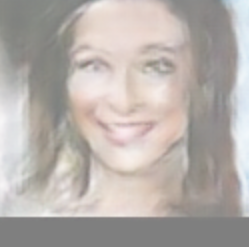

# FakeFaceGen-GAN Report

皇甫泊宁

本项目实现了一个深度卷积生成对抗网络，用于生成人脸图像。

## 实现过程

 `预处理 -> 数据加载 -> 网络构建 -> 训练 -> 生成` 

### 预处理 (`preprocess.py`)

为了使数据符合网络输入要求，我们需要对原始的 Celeb-A 数据集进行预处理，将所有图片统一处理成 64×64 像素的规格。

### 数据加载 (`dataloader.py`)

- 一个名为 `DataGenerater` 的自定义数据集类。
- 工作机制：
  1. 在初始化时加载所有预处理过的图片路径。
  2. 在每次迭代时读取图片，将其尺寸调整为 64×64，并将维度顺序转换为 PyTorch 的 (C, H, W)。
  3. 最终，使用 `torch.utils.data.DataLoader` 将数据集封装成一个数据加载器，设置 `batch_size` 为 128，并启用 `shuffle=True` 以确保训练的随机性。`pin_memory=True` 的使用可以加速数据从CPU到GPU的传输。

### 网络模型结构 (`network.py`)

#### 判别器 (Discriminator)

判别器的目标是接收一张 3×64×64 的图像，并输出一个介于0和1之间的概率值，判断该图像为真实图像的可能性。

由一系列的二维卷积层 (`nn.Conv2d`)、批归一化层 (`nn.BatchNorm2d`) 和 LeakyReLU 激活函数组成。网络通过带有步长（stride=2）的卷积操作，逐步将输入图像的特征图尺寸减半，同时增加通道数，最终提取出高维特征。

- **输入**: (N,3,64,64) 的图像张量。
- **中间层**: 包含4个卷积块，每个块主要由 `Conv2d`、`BatchNorm2d` 和 `LeakyReLU(0.2)` 构成。
- **输出层**: 最后一个卷积层将特征图压缩至 (N,1,1,1) 的大小，并经过 `Sigmoid` 激活函数，输出一个代表“真实”概率的值。

#### 生成器 (Generator)

接收一个100维的随机噪声向量，并将其“上采样”变换为一张 3×64×64 的伪图像。

其结构主要由一系列的二维转置卷积层 (`nn.ConvTranspose2d`)、批归一化层 (`nn.BatchNorm2d`) 和 ReLU 激活函数组成。

- **输入**: (N,100,1,1) 的随机噪声。
- **中间层**: 包含4个转置卷积块，每个块主要由 `ConvTranspose2d`、`BatchNorm2d` 和 `ReLU` 构成。
- **输出层**: 最后一个转置卷积层生成 (N,3,64,64) 的图像张量，并经过 `Tanh` 激活函数，将像素值缩放到 [−1,1] 的范围内。

## `train.py` 的大致思路

`train.py` 核心思想是交替优化判别器 `D` 和生成器 `G`。

1. **初始化**：
   - 定义损失函数为二元交叉熵损失 `nn.BCELoss`，适合处理二分类（真/假）问题。
   - 为两个网络分别设置 Adam 优化器，配置学习率为 0.0002，β1 为 0.5。
2. **交替训练循环**： 对于训练集中的每一个批次（batch）的数据，执行以下两个步骤：
   - **优化判别器 `D`**：
     - 将真实图像输入 `D`，计算其输出与“真实”标签之间的损失 (`errD_real`)。
     - 让 `G` 生成一批假图像。将这些假图像输入 `D`，计算其输出与“虚假”标签（值为0）之间的损失 (`errD_fake`)。使用 `.detach()` 来阻止梯度流回生成器。
     - `D` 的总损失是 `errD_real + errD_fake`。对此损失进行反向传播，并更新 `D` 的权重。
   - **优化生成器 `G`**：
     - 将上一步中 `G` 生成的假图像再次输入 `D`。
     - 我们计算 `D` 的输出与“真实”标签（值为1）之间的损失。如果 `G` 表现得好，`D` 的输出会接近1，损失就会变小。
     - 对此损失进行反向传播，更新 `G` 的权重。

## 效果图

在完成了5个周期的训练后，我们使用 `generator.py` 脚本加载训练好的 `generator.params` 模型参数，输入随机噪声向量来生成新的人脸图像。以下是挑选的几张效果较好的生成图片。

## Bonus-1：生成质量评估 (FID)

引入 Fréchet Inception Distance (FID) 评价指标，评估我们模型生成图像的真实性和多样性。

### 评估程序实现

编写了一个独立的评估脚本来计算 FID 分数，其主要流程如下：（具体见  `evaluate.py`）

1. **预训练模型**：使用在 ImageNet 上预训练好的 Inception-v3 模型，并移除了其最后的分类层。
2. **提取特征向量**：
   - **真实图像**：将测试集中的真实图像（经过预处理）送入 Inception-v3 模型，获取它们的特征向量，形成真实特征集。
   - **生成图像**：加载生成器 (`generator.params`)，生成一批伪造图像，然后同样将它们送入 Inception-v3 模型，获取其特征向量，形成生成特征集。
   - Inception-v3 模型要求输入图像尺寸为 299×299，因此在送入网络前，所有图像（无论真实或生成）都被上采样到了这个尺寸。
3. **计算 FID 分数**：利用两个特征集（真实的和生成的），根据 FID 的公式，计算它们的均值和协方差，最终得到一个单一的分数。

### 结果分析

经过运行评估程序，我们模型的最终 FID 分数为：

**Fréchet Inception Distance (FID): 33.1177**

## Bonus-2：更高的分辨率（128x128）

修改图像预处理 `network_128.py` 以及模型训练参数 ，获得128*128的图像：

虽然生成效果有一定的下降，但由于分辨率的提高，这样的下降是可以接受的。